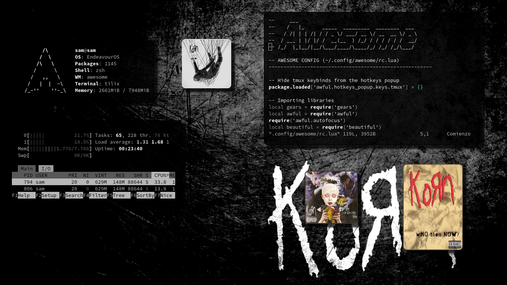

<h1 align='center'>My Configuration rice AwesomeWM</h1>

**ⵃ Thanks for visiting!**

### Details:

- [x] OS: [EndeavourOs](https://endeavouros.com/)
- [x] WM: [AwesomeWM](https://awesomewm.org/)
- [x] Panel: [Polybar](https://github.com/polybar/polybar)
- [x] Compositor: [Ibhagwan's Picom Fork](https://github.com/ibhagwan/picom)
- [x] Terminal: [Tilix](https://gnunn1.github.io/tilix-web/)
- [x] Wallpaper: [Alphacoders](https://images.alphacoders.com/233/233713.jpg)
- [x] Shell: [OhMyZsh](https://ohmyz.sh/)
- [x] GTK Theme: 
- [x] Music Visualizer: [Cava](https://github.com/karlstav/cava) 
- [x] Application Launcher: [Rofi](https://github.com/davatorium/rofi)
- [x] Notifications: [Dunst](https://dunst-project.org/)
- [x] Calendary: [Calcurse](https://calcurse.org/)
